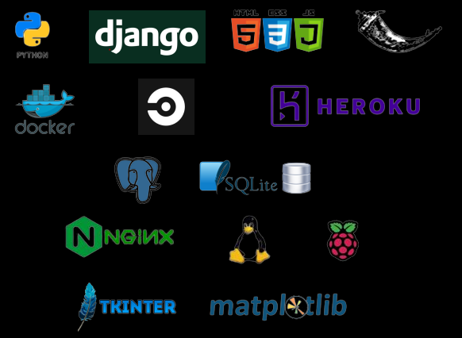

### Hi there 👋, I'm Olivier

<!--
**oliviersamin/oliviersamin** is a ✨ _special_ ✨ repository because its `README.md` (this file) appears on your GitHub profile.

Here are some ideas to get you started:

- 🔭 I’m currently working on ...
- 🌱 I’m currently learning ...
- 👯 I’m looking to collaborate on ...
- 🤔 I’m looking for help with ...
- 💬 Ask me about ...
- 📫 How to reach me: ...
- 😄 Pronouns: ...
- ⚡ Fun fact: ...
-->

I'm Olivier SAMIN, Python & Django application developper.  

## About me!
* I'm French, 41 years old, living in Fuerteventura (Canary islands) with my wife and 3 year old daughter.
* I've just graduated from Openclassrooms online formation. I am officially a Python application developper (Web, APIs but not only...)
* I'm currently looking for REMOTE job opportunities (as I'm very well in Fuerteventura)
* You can find my updated CV [here](https://github.com/oliviersamin/CV)

## Languages and tools

